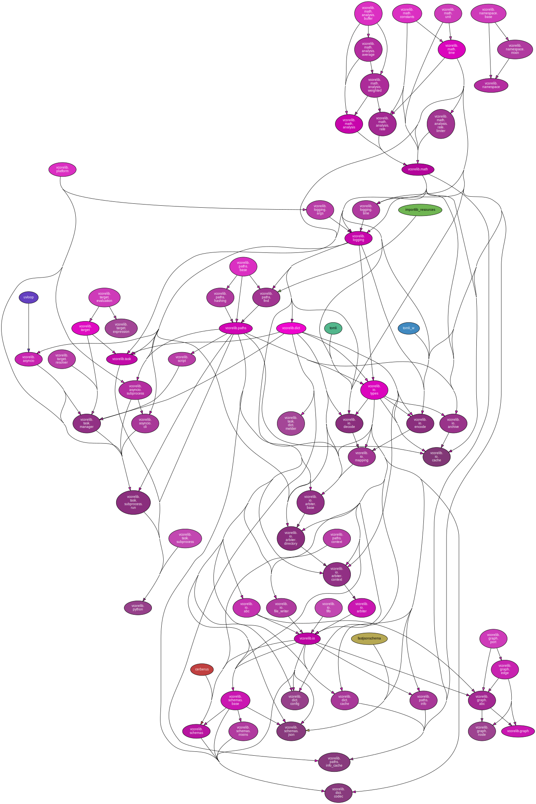

<!--
    =====================================
    generator=datazen
    version=2.1.0
    hash=9192f113b67aec5bfbb31057ffbed4d6
    =====================================
-->

# vcorelib ([0.7.2](https://pypi.org/project/vcorelib/))

*A collection of core Python utilities.*

See also: [generated documentation](https://vkottler.github.io/python/pydoc/vcorelib.html)
(created with [`pydoc`](https://docs.python.org/3/library/pydoc.html)).

# Internal Dependency Graph

A coarse view of the internal structure and scale of
`vcorelib`'s source.
Generated using [pydeps](https://github.com/thebjorn/pydeps) (via
`mk python-deps`).

